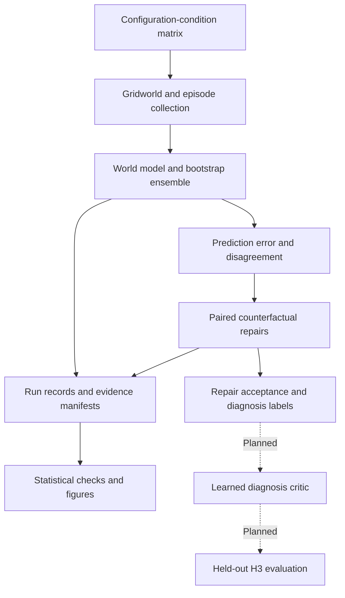

# Beyond Uncertainty

**When a world model makes a bad prediction, does it need more data or a
different model?**

This research project studies that question in controlled gridworld
environments. It distinguishes **estimation failure**, which more experience
may repair, from **hypothesis-class failure**, which may require restoring a
missing feature or increasing model capacity.

The research design uses counterfactual repairs to establish diagnosis labels:
run the candidate repairs and measure what actually improves. Its eventual goal
is a learned diagnosis critic that predicts the required repair. The repository
currently contains the experimental infrastructure and development evidence;
the learned critic and final hypothesis evaluations remain future work.

## Research status

The latest recorded [project snapshot](PROJECT_STATE.md) is dated **2026-08-23**
and reports completion of Weeks 4–5 of the infrastructure phase. These are
documented project milestones, not a fresh execution or independent validation
of the experiments.

| Research question | Recorded status |
|---|---|
| **H1:** Does ensemble disagreement track estimation failure? | Development reliability gate passed; confirmatory hypothesis not tested |
| **H2:** Is the disagreement-to-error ratio low under hypothesis-class failure? | Not tested |
| **H3:** Can a learned critic outperform a fitted error/disagreement rule by more than five percentage points? | Not tested; critic training and evaluation remain planned |

The project record also reports **Gate 1 failed its minimum detectable effect
condition**, with its second condition not adjudicable. A development reliability
gate passing does not establish H1 or remove the broader design constraints.
See the [decision ledger](DECISIONS.md) for the recorded reasoning.

## What is implemented

- **Controlled failure conditions:** a gridworld, factored observations, feature
  masking, model-capacity variations, and a scripted data-collection policy.
- **World models and uncertainty:** PyTorch MLPs, episode bootstrap ensembles,
  explicit prediction policies, and disagreement/error measurements.
- **Repair infrastructure:** paired baseline and repair runs, fixed evaluation
  pools, acceptance tests, and threshold-calibration support.
- **Experimental controls:** separate development and confirmatory seeds,
  named random-number streams, group-aware analysis, and immutable evidence
  attempts with manifests and provenance.
- **Statistical tooling:** trend tests, repair acceptance, minimum detectable
  effect simulations, and reproduction of figures from stored logs.
- **Critic preparation:** a frozen feature whitelist and a balancing procedure
  exercised on synthetic labelled inputs. These do not constitute a trained
  diagnosis model or a completed real-label dataset.

## Experimental workflow



The enumerator defines a pool of **300 configuration-conditions in 240 comparison
groups**. These are design units, not 300 completed or successfully labelled
experiments. Actual labels depend on the counterfactual repair results;
ambiguous and undiagnosed conditions can reduce the usable dataset.

## Install and inspect

Requires **Python 3.11 or newer**. Exact dependencies, including PyTorch,
Gymnasium, NumPy, SciPy, pandas, and pytest, are pinned in
[pyproject.toml](pyproject.toml). The commands below use a Unix-style shell;
on Windows, use the corresponding `.venv\Scripts\python.exe` path.

```bash
git clone https://github.com/RAMZI0TO99/beyond-uncertainty.git
cd beyond-uncertainty
python3 -m venv .venv
.venv/bin/python -m pip install -e ".[dev]"
.venv/bin/python -m pytest -q
```

The original research environment uses
`python3 -m venv --system-site-packages .venv` to reuse an installed CUDA-enabled
PyTorch when it satisfies the pinned version. A fully isolated environment is
the default above. Choose a compatible Python/platform combination for the
pinned packages; installation and the full suite have not been re-run as part
of this README update.

Inspect the design matrix without running model training:

```bash
.venv/bin/python -m bu.experiments.enumerate_units
```

The report distinguishes construction families from measured diagnosis labels,
lists stage obligations, and accounts for model fits shared across stages.

## Reproduce figures from existing evidence

From the repository root:

```bash
.venv/bin/python -m bu.experiments.make_figures
```

This reads the tracked Week 3 pilot summaries and Week 4 gate evidence and
writes the registered figures under `figures/`. It does not train models and
fails if required logs are absent. Figure generation does not turn development
results into confirmatory claims.

| Evidence | What it contains |
|---|---|
| [Week 3 pilot](runs/w3_pilot/attempt-001/) | Development sweep summary and manifest |
| [Week 4 reliability gate](runs/w4_gate/) | Rung-specific evidence, records, metrics, and verdict |
| [Threshold calibration](runs/w4_threshold/attempt-001/) | Calibration record, arrays, and source run records |
| [Timing evidence](runs/w4_timing/attempt-003/) | Timing record and its schema correction note |
| [Tests](tests/) | Checks for identities, pairing, seeds, evidence contracts, models, and statistics |

The Week 3 pilot records a useful complication: prediction error falls as
training data increases, while ensemble disagreement peaks at an intermediate
data size. The evidence and development/confirmatory boundary are retained so
that this observation can be examined without presenting it as a final result.

Most generated outputs are ignored by Git. Selected evidence is explicitly
tracked so a fresh clone can inspect the records behind the documented claims;
see [.gitignore](.gitignore) for the evidence allowlist.

## Reproducibility model

### Four identities

```python
from bu import Arm, Config, UnitSpec

unit = UnitSpec(
    family="missing_feature",
    withheld_features=("shape",),
    n_transitions=500,
)
baseline = Config(unit=unit, arm=Arm("baseline"))
repaired = Config(unit=unit, arm=Arm("feature_repair"))
assert baseline.unit_id == repaired.unit_id
```

| Identity | Meaning |
|---|---|
| `unit_id` | Configuration-condition shared by a failure condition and its repair arms |
| `config_id` | Unit plus the baseline or repair arm |
| `run_id` | Configuration plus stage and seed: the experimental obligation |
| `fit_id` | Configuration plus seed, without stage: the underlying computation |

Keeping fits separate from experimental obligations prevents double-counting
shared work. Statistical analyses use configuration-conditions rather than
treating transitions as independent observations. Comparison groups contain
deliberately related data, so splitting and resampling must respect them.

### Seeds and provenance

Seeds below `CONFIRMATORY_SEED_BASE` (`1000`) are development data and are
excluded from confirmatory analyses, threshold calibration, repair acceptance,
and the critic. Use `require_confirmatory=True` when loading runs for
confirmatory claims; the seed boundary alone is not evidence that a hypothesis
was tested.

Run records store the configuration, seed, Git revision, dirty-tree flag, and
package versions. JSONL metrics flush line by line. For example, this writes a
**synthetic logging example**, not an experimental result:

```python
from bu import Config, RunLogger, UnitSpec, load_runs

cfg = Config(unit=UnitSpec(n_transitions=1000), seed=0)
with RunLogger.start(cfg) as log:
    log.log(epoch=0, split="val", mse=0.42)

df = load_runs("runs")
```

## Code and research documents

| Path | Purpose |
|---|---|
| [src/bu/env/](src/bu/env/) | Gridworld, observations, policy, episode collection |
| [src/bu/models/](src/bu/models/) | World models, training, ensembles, uncertainty |
| [src/bu/experiments/](src/bu/experiments/) | Design matrix, evidence drivers, repairs, figures |
| [src/bu/stats/](src/bu/stats/) | Trend, gate, acceptance, and power-analysis tools |
| [src/bu/critic/](src/bu/critic/) | Feature schema and synthetic-input balancing infrastructure |
| [src/bu/constants.py](src/bu/constants.py) | Preregistered constants; changes require a recorded decision |
| [Research design](docs/thesis_project_plan_v1_2.docx) | Authoritative study design |
| [Execution schedule](docs/thesis_day_by_day_schedule_v1_2.docx) | Planned 20-week schedule |
| [Methodology draft](docs/methodology_chapter.md) | Developing thesis methodology |

## Limits and ongoing work

This is a controlled research environment. Results should not be generalized
to deployed robots, unrelated model classes, or arbitrary data distributions.
The recorded development experiments, threshold calibration, and infrastructure
checks have different purposes from final H1–H3 evaluations. The remaining work
includes the permitted confirmatory experiments, real repair-based labels,
grouped critic training, and held-out comparisons, subject to the recorded gates.

## Maintainer and review handoff

Operational material is kept separately from the visitor-facing overview:

- [PROJECT_STATE.md](PROJECT_STATE.md): dated snapshot, gates, deviations, and open questions.
- [DECISIONS.md](DECISIONS.md): append-only decision ledger.
- [CLAUDE.md](CLAUDE.md) and [SOL_BRIEF.md](SOL_BRIEF.md): existing operational and reviewer handoffs.
- [DELTA_TO_SOL.md](DELTA_TO_SOL.md): review handoff updates.
- [PROJECT_STATE_ARCHIVE.md](PROJECT_STATE_ARCHIVE.md): archived session history.
- [scripts/sol_bundle.sh](scripts/sol_bundle.sh): verification bundle tooling.
- [scripts/sol_evidence_archive.sh](scripts/sol_evidence_archive.sh): tracked threshold-evidence archive tooling.

## License

See [LICENSE](LICENSE) for the repository's existing license.
